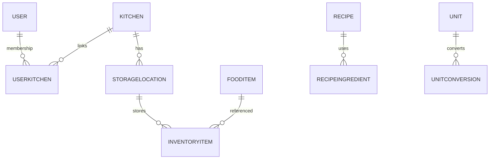
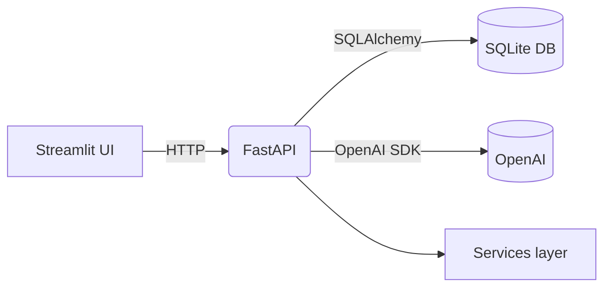

# NUGAMOTO – Smart Kitchen Assistant

*FastAPI + Streamlit platform that manages kitchens, inventory, recipes, and AI-generated meal ideas.*

## Features

* User and kitchen management with role-based access
* Inventory tracking with storage locations and unit conversions
* Recipe CRUD plus AI recipe generation via OpenAI
* Shopping list and product catalog
* Streamlit dashboard and REST API with JWT auth

## Project Structure

```text
NUGAMOTO_/
├── backend/                 # FastAPI app
│   ├── api/v1/              # Routers
│   ├── core/                # config & deps
│   ├── crud/                # DB operations
│   ├── db/                  # engine, init, seed
│   ├── models/              # SQLAlchemy models
│   ├── schemas/             # Pydantic schemas
│   ├── security/            # JWT & passwords
│   └── services/            # AI & conversions
├── frontend/                # Streamlit UI
│   ├── app.py               # entrypoint
│   ├── clients/             # API clients
│   └── pages/               # dashboard pages
├── docs/                    # additional docs
├── tests/                   # test scaffold
└── requirements.txt
```

## Tech Stack

Python 3 · FastAPI · SQLAlchemy · Pydantic · Streamlit · OpenAI · SQLite · Requests

## Getting Started

```bash
python3 -m venv .venv
source .venv/bin/activate
pip install -r requirements.txt

# create and seed SQLite
python -m backend.db.init_db --reset
python -m backend.db.seed_db

# run API & frontend
uvicorn backend.main:app --reload
streamlit run frontend/app.py
```

**App:** [http://localhost:8000](http://localhost:8000) · **Docs:** `/docs` · **Frontend:** [http://localhost:8501](http://localhost:8501)

## Configuration

| Variable                        | Purpose                        | Default                              |
| ------------------------------- | ------------------------------ | ------------------------------------ |
| `DATABASE_URL`                  | DB connection string           | `sqlite:///./nugamoto.sqlite`        |
| `OPENAI_API_KEY`                | OpenAI access token            | `dummy-key`                          |
| `SECRET_KEY`                    | JWT signing key                | `CHANGE_ME_TO_A_SECURE_RANDOM_VALUE` |
| `ALGORITHM`                     | JWT algorithm                  | `HS256`                              |
| `ACCESS_TOKEN_EXPIRE_MINUTES`   | Access token lifetime          | `60`                                 |
| `REFRESH_TOKEN_EXPIRE_DAYS`     | Refresh token lifetime         | `14`                                 |
| `EXPIRING_ITEMS_THRESHOLD_DAYS` | Inventory warning window       | `3`                                  |
| `ADMIN_EMAILS`                  | CSV whitelist for admin rights | `""`                                 |
| `ADMIN_EMAIL_DOMAINS`           | CSV domain whitelist           | `""`                                 |
| `API_URL`                       | (Frontend) backend base URL    | `http://localhost:8000`              |

## Build & Run

### Dev

```bash
uvicorn backend.main:app --reload
streamlit run frontend/app.py
```

### Prod

```bash
uvicorn backend.main:app
```

## Tests & Quality

```bash
pytest
coverage run -m pytest
coverage report
ruff backend frontend
mypy backend frontend
```

## API

Interactive docs at `/docs` and `/redoc`. See `docs/api.md` for endpoint details.

## Data Model



## Architecture



## Roadmap

* Harden auth & security
* Expand AI features
* Dockerize deployment
* Increase test coverage
* Frontend polish

## Contributing

* Fork & branch from `main`
* Ensure tests and linters pass
* Use clear commit messages
* Open a PR

## License

MIT
