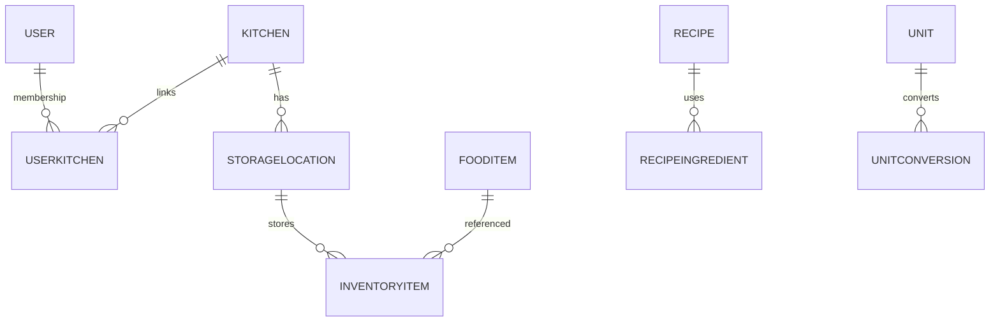
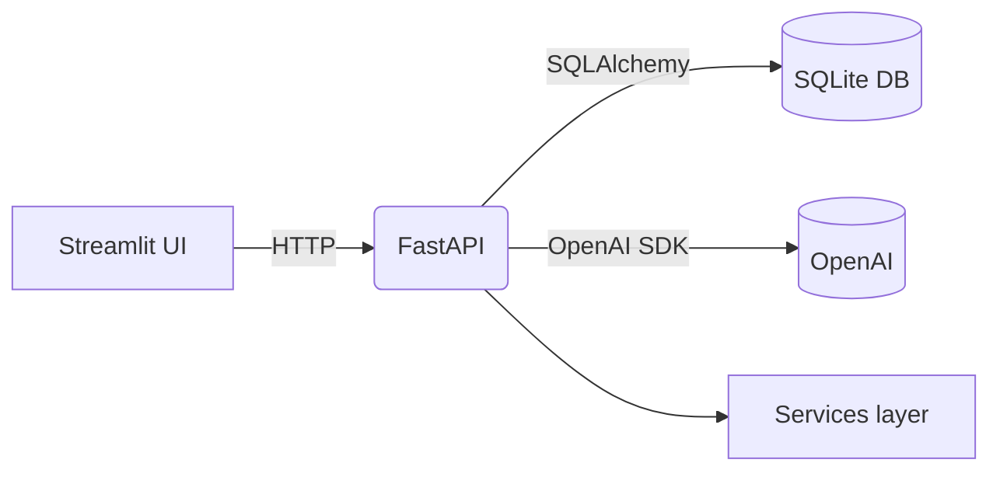

# NUGAMOTO – Smart Kitchen Assistant

*FastAPI + Streamlit platform that manages kitchens, inventory, recipes, and AI-generated meal ideas.*

## Features

* User and kitchen management with role-based access
* Inventory tracking with storage locations and unit conversions
* Recipe CRUD plus AI recipe generation via OpenAI
* Shopping list and product catalog
* Streamlit dashboard and REST API with JWT auth

## Project Structure

```text
NUGAMOTO_/
├── backend/                 # FastAPI app
│   ├── api/v1/              # Routers
│   ├── core/                # config & deps
│   ├── crud/                # DB operations
│   ├── db/                  # engine, init, seed
│   ├── models/              # SQLAlchemy models
│   ├── schemas/             # Pydantic schemas
│   ├── security/            # JWT & passwords
│   └── services/            # AI & conversions
├── frontend/                # Streamlit UI
│   ├── app.py               # entrypoint
│   ├── clients/             # API clients
│   └── pages/               # dashboard pages
├── docs/                    # additional docs
├── tests/                   # test scaffold
└── requirements.txt
```

## Tech Stack

Python 3 · FastAPI · SQLAlchemy · Pydantic · Streamlit · OpenAI · SQLite · Requests

## Getting Started

```bash
python3 -m venv .venv
source .venv/bin/activate
pip install -r requirements.txt

# create and seed SQLite
python -m backend.db.init_db --reset
python -m backend.db.seed_db

# run API & frontend
uvicorn backend.main:app --reload
streamlit run frontend/app.py
```

**App:** [http://localhost:8000](http://localhost:8000) · **Docs:** `/docs` · **Frontend:** [http://localhost:8501](http://localhost:8501)

## Configuration

| Variable                        | Purpose                        | Default                              |
| ------------------------------- | ------------------------------ | ------------------------------------ |
| `DATABASE_URL`                  | DB connection string           | `sqlite:///./nugamoto.sqlite`        |
| `OPENAI_API_KEY`                | OpenAI access token            | `dummy-key`                          |
| `SECRET_KEY`                    | JWT signing key                | `CHANGE_ME_TO_A_SECURE_RANDOM_VALUE` |
| `ALGORITHM`                     | JWT algorithm                  | `HS256`                              |
| `ACCESS_TOKEN_EXPIRE_MINUTES`   | Access token lifetime          | `60`                                 |
| `REFRESH_TOKEN_EXPIRE_DAYS`     | Refresh token lifetime         | `14`                                 |
| `EXPIRING_ITEMS_THRESHOLD_DAYS` | Inventory warning window       | `3`                                  |
| `ADMIN_EMAILS`                  | CSV whitelist for admin rights | `""`                                 |
| `ADMIN_EMAIL_DOMAINS`           | CSV domain whitelist           | `""`                                 |
| `API_URL`                       | (Frontend) backend base URL    | `http://localhost:8000`              |

## Build & Run

### Dev

```bash
uvicorn backend.main:app --reload
streamlit run frontend/app.py
```

### Prod

```bash
uvicorn backend.main:app
```

## MCP Quick Test

Follow this checklist once to verify that the MCP bridge works:

1. Start the FastAPI server (reload flag optional during development):

   ```bash
   uvicorn backend.main:app --reload
   ```

2. (First-time setup) Create yourself an account by calling the registration endpoint. Replace the sample data with your own email/password. You only need to do this once per database.

   ```bash
   curl -X POST "http://localhost:8000/v1/auth/register" \
     -H "Content-Type: application/json" \
     -d '{"name": "Demo User", "email": "demo@example.com", "password": "demo-password"}'
   ```

3. Use the bundled CLI to log in and fetch an access token. The command prints the token and, if you pass `--save-token`, writes it to a file for later reuse.

   ```bash
   python mcp_cli.py login --email demo@example.com --password "demo-password" --save-token .token
   ```

4. List the available MCP tools and execute a protected one (e.g. `get_current_user_profile`). Pass the token string if the route needs authentication:

   ```bash
   python mcp_cli.py list --token "$(cat .token)"
   python mcp_cli.py call get_current_user_profile --token "$(cat .token)"
   ```

5. Connect from IDE agents (VS Code / Continue / Copilot Agent Mode) via SSE. Supply the same bearer token so authenticated routes continue to work:

   ```json
   {
     "type": "sse",
     "serverUrl": "http://localhost:8000/mcp",
     "headers": {
       "Authorization": "Bearer <your-access-token>"
     }
   }
   ```

6. When the access token expires, re-run the login command (step 3) or call `/v1/auth/refresh` with the stored refresh token to obtain a new one.

### Beginner-Friendly Walkthrough

If you are starting from scratch, these commands take you from cloning the repo to running your first MCP query:

```bash
# 1) Prepare a virtual environment and install dependencies
python3 -m venv .venv
source .venv/bin/activate
pip install -r requirements.txt

# 2) Initialize the SQLite database with sample data (optional but handy)
python -m backend.db.init_db --reset
python -m backend.db.seed_db

# 3) Launch the API
uvicorn backend.main:app --reload

# 4) Register a user (if you did not run the seed script or need a new account)
curl -X POST "http://localhost:8000/v1/auth/register" \
  -H "Content-Type: application/json" \
  -d '{"name": "Demo User", "email": "demo@example.com", "password": "demo-password"}'

# 5) Log in through the CLI and save the access token to a file
python mcp_cli.py login --email demo@example.com --password "demo-password" --save-token .token

# 6) Ask MCP for your user profile while passing the saved token
python mcp_cli.py call get_current_user_profile --token "$(cat .token)"
```

The CLI defaults to `http://localhost:8000/mcp`. To target another host or port (for example when the API runs on a remote machine or inside Docker), add `--server "http://<host>:<port>/mcp"` to every command.

## Tests & Quality

```bash
pytest
coverage run -m pytest
coverage report
ruff backend frontend
mypy backend frontend
```

## API

Interactive docs at `/docs` and `/redoc`. See `docs/api.md` for endpoint details.

## Data Model



## Architecture



## Roadmap

* Harden auth & security
* Expand AI features
* Dockerize deployment
* Increase test coverage
* Frontend polish

## Contributing

* Fork & branch from `main`
* Ensure tests and linters pass
* Use clear commit messages
* Open a PR

## License

MIT
